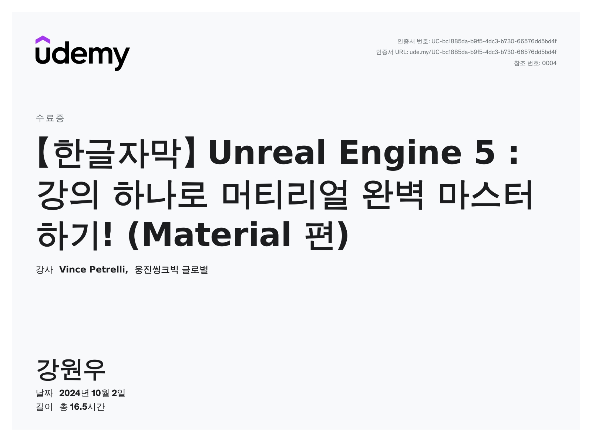

# 🎨 Unreal Engine Material Master System

> **"기초부터 심화까지, 언리얼 엔진 머티리얼 시스템의 완벽한 이해"**  
>
> Udemy 강의 **'Unreal Engine 5 : 강의 하나로 머티리얼 완벽 마스터하기!'**를 기반으로 언리얼 엔진의 PBR 렌더링 원리부터 고급 셰이더 기법(Dissolve, Distortion, World Aligned 등)을 학습하고 구현한 프로젝트입니다.

---

## 📋 1. 프로젝트 개요 (Overview)

* **프로젝트명:** Udemy Unreal Material Master Study
* **유형:** Unreal Engine 머티리얼 및 셰이더 시스템 학습 프로젝트
* **개발 인원:** 1인 개발  
* **공부 목적:** 언리얼 머티리얼의 기초적인 구조 이해 및 효율적인 마스터 머티리얼 구축 능력 습득
* **공부 기간:** 2024.08.04.-2024.10.03.
* **주요 특징:**  
    * PBR(Physically Based Rendering) 기반의 기본 속성(Albedo, Roughness, Normal 등) 심화 학습   
    * 인스턴싱(Material Instance)을 통한 효율적인 워크플로우 구축
    * 수학적 노드 연산을 활용한 커스텀 셰이더 효과 구현
    * 강의 복습 및 응용을 통한 작품 및 개인 머티리얼 라이브러리 제작
---
## 🎥 2. 실습 영상 (Practice Video)

> *아래 링크를 클릭하면 유튜브에서 고화질로 시청할 수 있습니다. (YouTube)*

### Section 3 Master Material 실습 영상

[YouTube : AutoLandscape 실습 영상](https://youtu.be/ZhOIoxR-UVw?si=ySgzMdolt7KxtnmS)

https://github.com/user-attachments/assets/6adc162b-01b1-4155-92fc-a2d692d7edd4

### Section 4 Scene 실습 영상

[YouTube : AutoLandscape 실습 영상](https://youtu.be/h0AqDmeFbA8?si=e7mw7ZHxvZtJzop3)

https://github.com/user-attachments/assets/a3af7ea0-a63f-4aa8-a381-54ba53c37fb2

### Section 5 AutoLandscape 실습 영상

[YouTube : Udemy 실습 영상](https://youtu.be/yoCBkarSS-E?si=uI-nLuDLdOKbGAkE)

https://github.com/user-attachments/assets/55f5ae26-310f-429e-aa35-5b9cbb86619c

---

## 🛠️ 3. 사용 기술 (Tech Stack)

### Engine & Language
*   **Unreal Engine 5.6**: Core Engine (최신 기능 활용)
*   **Material Editor**: 노드 기반 셰이더 그래프 설계
*   **Photoshop**: 커스텀 텍스처 소스 제작 및 편집
*   **Camera Sequencer**: 몰입감 있는 시네마틱 카메라 연출

### Core Concepts
* PBR Workflow: 금속성(Metallic)과 거칠기(Roughness)의 물리적 상관관계 학습
* Master Material/Function: 재사용성을 극대화한 범용 마스터 머티리얼 설계
* Advanced Effects: UV 조작(Panner, Rotator)을 이용한 동적 효과
* World Aligned Blend: 고도 및 각도 기반 자동 텍스처 블렌딩
* Masking & Layering: 채널 마스킹을 활용한 디테일 표현 기법

---

## 💡 4. 주요 학습 내용 (Features)

- [머터리 학습 노트 보기](https://github.com/KINGWONWOO/obsidian/blob/44cfd75bafca5f5c7cf6059c8cfce293bb441a6d/%EC%96%B8%EB%A6%AC%EC%96%BC%20%EA%B3%B5%EB%B6%80/Unreal/%EC%9D%BC%EC%9D%BC%20%EA%B3%B5%EB%B6%80/2-UE5%20Material(24.08.04.~24.10.03.)/merged%20copy.md)

---

## ⚙️ 5. 주요 구현 내용

### 1️⃣ Master Material Workflow

- 공통 기능 카테고리화 및 함수 생성으로 범용성 확장.
- 스위치(Static Switch) 노드를 활용한 기능 On/Off 시스템 구축
- 매개변수(Parameter) 그룹화를 통한 아티스트 친화적 UI 구성
- 불필요한 연산을 줄이는 최적화된 노드 그래프 설계 

---

### 2️⃣ Dynamic Effects

- Dissolve: Noise 텍스처와 Step 노드를 활용한 점진적 소멸 효과 구현
- Distortion: Normal 맵의 UV를 오프셋하여 굴절 및 일렁임 효과 표현
- Panner: 시간(Time) 노드를 연동한 흐르는 물이나 구름 이동 구현

---

### 3️⃣ Interaction & Environment

- Vertex Color: 페인팅을 통한 실시간 지형/사물 텍스처 블렌딩
- Distance Field: 물체 간의 거리를 감지하여 경계면에 이펙트(안개, 거품 등) 생성
- Post Process: 전체 화면에 적용되는 외곽선(Outline) 및 필터 효과 학습
- 고도 및 경계 각도에 따른 다른 Material이 적용되는 Auto Landscape 구현
- Virtual Texture 도입을 통한 대규모 환경 최적화 학습

---

## 🚀 6. 트러블 슈팅 (Troubleshooting)

### 이슈 1: 텍스처 타일링 시 반복 패턴이 눈에 띄는 현상
- **문제**: 넓은 지형에 동일한 텍스처를 적용했을 때 격자무늬(Tiling)가 반복되어 부자연스러워 보임.
- **해결**: Macro Variation 기법을 적용했습니다. 서로 다른 스케일의 Noise 텍스처를 원본 텍스처와 Multiply/Lerp로 혼합하여 큰 스케일의 색상 변화를 유도함으로써 반복감을 효과적으로 제거했습니다.

### 이슈 2: 투명 머터리얼(Translucent)의 렌더링 순서 및 굴절 문제
- **문제**: 물이나 유리 머터리얼 적용 시 뒤쪽 오브젝트와의 겹침 현상이나 물리적으로 어색한 굴절 발생.
- **해결**: Refraction 모드를 'Pixel Normal Offset'으로 변경하여 성능 효율을 높이고, 머터리얼 설정에서 'Separate Translucency' 옵션을 조절하여 렌더링 우선순위를 최적화했습니다.

### 이슈 3: 마스터 머터리얼의 복잡도 증가로 인한 성능 저하
- **문제**: 너무 많은 기능을 한 머터리얼에 넣으면서 인스트럭션(Instruction) 수가 급증함.
- **해결**: Static Switch Parameter를 적극 활용했습니다. 사용하지 않는 기능은 컴파일 단계에서 제외되도록 설계하여, 실제 런타임 시에는 필요한 연산만 수행되도록 최적화했습니다.

## 📚 7. 공부 확장 방향(Future Study Plan)

- HLSL을 활용한 커스텀 노드 프로그래밍 연구
- Virtual Texture 도입을 통한 대규모 환경 최적화 학습
- HDR을 사용한 간단한 배경 구성
- Parallax Occlusion Mapping을 통한 가상 깊이감 표현 심화

---

**Contact:** (강원우 / king_wonwoo@naver.com)  
